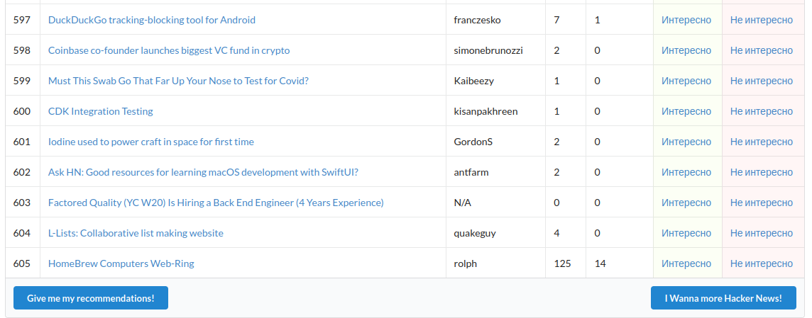
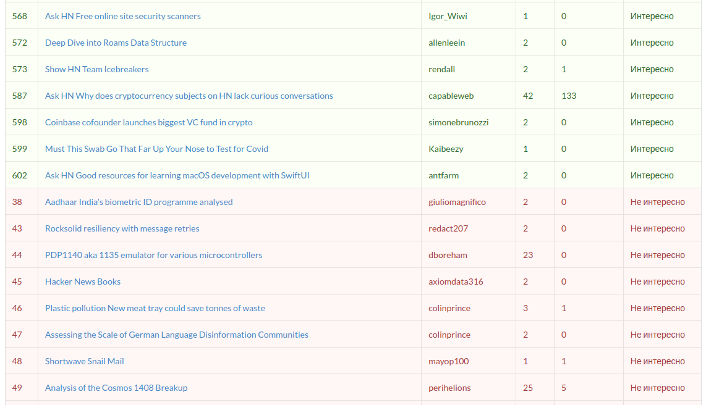

# hacker-news-feed

###### Python implementation of personalized Hacker News feed based on news that you have liked

It is a personalized feed that is based on Naive Bayes Classifier which is fitted by labels of your previous news.  
The feed is run on your localhost using Python [Bottle Framework](https://www.bottlepy.org/docs/dev/)  
This is how it works:

- Firstly, we get news from [Hacker News](https://news.ycombinator.com/).
- Then we train our model by simply vectorizing titles of our news and
  fitting [MultinomialNB from sklearn](https://scikit-learn.org/stable/modules/generated/sklearn.naive_bayes.MultinomialNB.html#sklearn.naive_bayes.MultinomialNB)
- In the end we get an html page of all news from Hacker News `localhost:<port>/news` and an html page for your own
  recommendations `localhost:<port>/classify`

Don't forget to run your server with `python3 main.py` 
 
  
All necessary Python libs are contained in `requirements.txt`

###### The 1.0 version was released on 21.11.2021